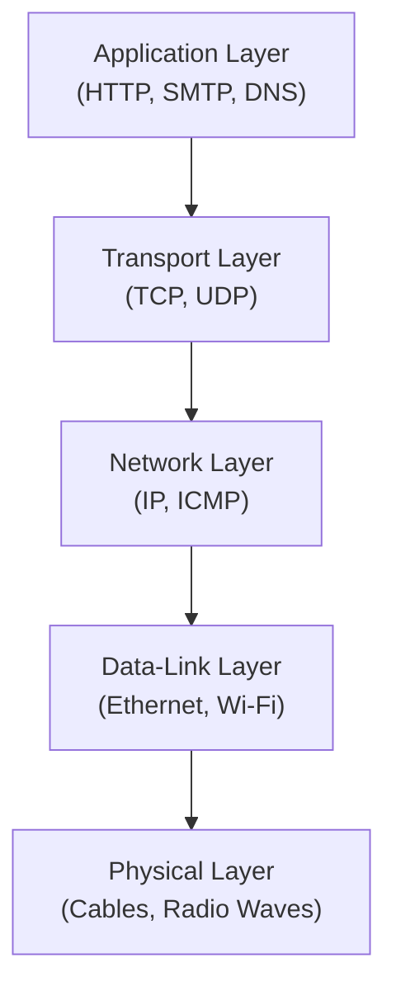
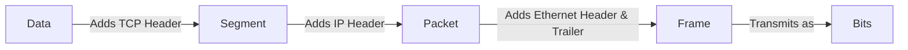
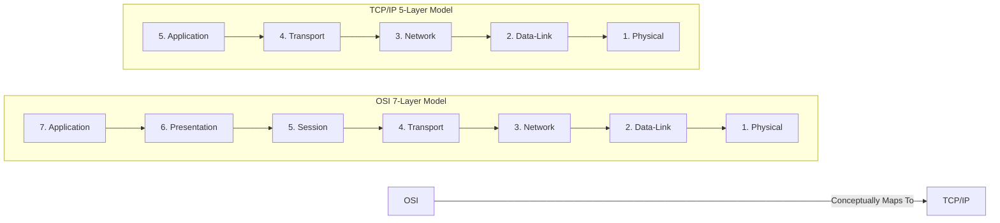
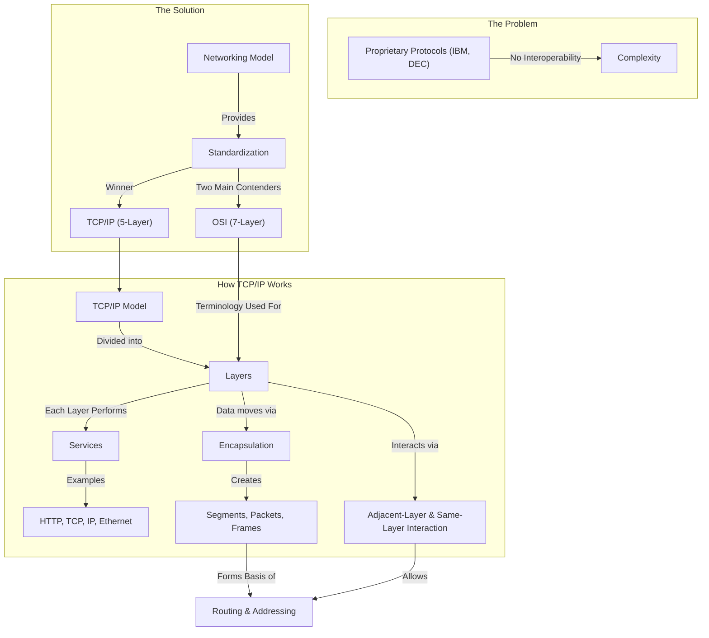

# Comprehensive Lecture: Chapter 1 - Network Fundamentals (CCNA 200-301 Official Cert Guide, Volume 1)

**Instructor's Note:** Based on your background as an engineering student with some networking knowledge but concerns about foundational gaps, this lecture will take a "ground-up" approach. We will not just memorize facts; we will **build a mental model** of how networks function. We will use analogies, visualizations, and a focus on the "why" behind the concepts to fill in those knowledge gaps and create a solid foundation for your CCNA journey.

---

## 1. Introduction: Why Do We Need a Networking Model?

### 1.1 The Problem: A Tower of Babel

Imagine a world where every computer manufacturer spoke a different language. IBM computers speak "IBM-ish," Apple computers speak "Apple-ese," and Unix servers speak "Unix-nese." For them to communicate, you would need a translator for every pair of languages. This was the reality of early networking in the 1970s and 1980s. Companies like IBM created their own proprietary networking models (e.g., Systems Network Architecture - SNA). If a company bought computers from IBM, DEC, and HP, the IT team had to build three separate, incompatible networks and then try to connect them. It was a logistical nightmare.

### 1.2 The Solution: A Common Blueprint (The Networking Model)

To solve this, the industry needed a **common language** and a **common set of rules** that everyone could agree upon. This agreement is called a **networking model** (or networking architecture or blueprint).

**Analogy: Building a House**
Think of a networking model like the architectural blueprint for a house.

- **The Framers, Electricians, and Plumbers** are like different networking hardware and software vendors (Cisco, Intel, Microsoft).
- **The Blueprint** ensures that the electrical wiring doesn't run through the plumbing pipes. It defines standards so that each specialist's work integrates seamlessly with the others.
- **The House Itself** is the final, functional network.

Without a blueprint, you might have a house that stands up, but it would be a chaotic, custom, one-off project. With a blueprint, you can have a house that is safe, reliable, and built to a standard that allows for future additions (like adding a new room or upgrading the wiring).

### 1.3 The Winner: TCP/IP

There were two main contenders for the "universal blueprint":

1.  **OSI (Open Systems Interconnection):** A formal, government-backed effort by the International Organization for Standardization (ISO). It was designed by committee, with a "standard-first, code-second" approach. It was comprehensive but slow to develop.
2.  **TCP/IP (Transmission Control Protocol/Internet Protocol):** A more informal, grassroots effort born from a U.S. Department of Defense project. It had a "code-first, standardize-second" approach. It was practical, flexible, and grew organically with the internet.

**TCP/IP won.** Today, TCP/IP is the dominant networking model in the world. While OSI "lost" the war, its terminology and layer numbering are still heavily used in the networking industry. This is why you'll hear terms like "Layer 2 switch" or "Layer 3 router."

---

## 2. The TCP/IP Networking Model: A Deep Dive

The TCP/IP model organizes networking functions into a stack of **layers**. Each layer has a specific job and provides services to the layer directly above it. This is called **adjacent-layer interaction**.

### 2.1 The Five Layers of the Modern TCP/IP Model (Your "Cheat Sheet")

We will use the **5-layer model** as it is the most common way to visualize TCP/IP today. From top (closest to the user) to bottom (closest to the physical wire), these are the layers.

### 2.2 Layer-by-Layer Breakdown

Let's examine each layer using the **Postal Service Analogy**.

- **The Sender:** You, writing a letter.
- **The Post Office (The Network):** The system that delivers your letter.

#### Layer 5: Application Layer

- **Function:** This is the layer that the user interacts with. It provides services to application software (web browsers, email clients).
- **Analogy:** The letter you are writing. It contains the actual content you want to communicate.
- **Key Protocol Example:** **HTTP (Hypertext Transfer Protocol)** . When you type a website address into your browser, your browser uses HTTP to ask the server for the web page.
- **How it Works:** Your browser sends an HTTP `GET` request for a file (e.g., `home.htm`). The web server responds with an HTTP reply, which includes the file contents. The reply header includes a status code like "200 OK" (success) or "404 Not Found" (error).
- **Engineering Context:** As a network engineer, you will often troubleshoot application issues. Is the web server down? Is the firewall blocking port 80 (HTTP) or 443 (HTTPS)? Understanding that applications generate data is the starting point for any troubleshooting flow.

#### Layer 4: Transport Layer

- **Function:** This layer provides end-to-end communication services for the application layer. Its main job is to manage the flow of data between two applications on different hosts.
- **Analogy:** Deciding how to send the letter. Do you send it via regular mail (unreliable, but fast) or certified mail with a return receipt (reliable, but slower)?
- **Key Protocols:**
  - **TCP (Transmission Control Protocol):** Provides **reliable** delivery. It ensures that *all* data arrives at the destination, and in the correct order.
  - **UDP (User Datagram Protocol):** Provides **unreliable** delivery. It is faster and used for streaming video, gaming, or DNS lookups where speed is more important than perfect delivery of every single packet.
- **Critical Feature: Error Recovery (TCP)**
  - TCP uses **sequence numbers** and **acknowledgments (ACKs)** .
  - **How it Works:** Imagine you send three TCP segments with sequence numbers 1, 2, and 3. If segment 2 gets lost in the network, the receiving computer will notice the gap (it received 1 and 3, but not 2). It will send an ACK back to the sender, asking for segment 2 to be retransmitted. This is **error recovery**.
  - **Engineering Context:** This is a classic troubleshooting point. If you see a lot of TCP retransmissions in a network capture, it indicates packet loss, which could be due to a bad cable, a congested router, or a faulty interface.

#### Layer 3: Network Layer

- **Function:** The primary function is **routing** and **addressing**. This layer defines how data gets from the source to the destination, potentially across multiple different networks.
- **Analogy:** The postal service's sorting and forwarding system. The post office looks at the city and ZIP code on your letter to decide which truck or plane to put it on next.
- **Key Protocol:**
  - **IP (Internet Protocol):** The core of the TCP/IP model.
- **Key Concepts:**
  - **IP Addresses:** Every device on a TCP/IP network needs a unique IP address to be identified. This is like your unique mailing address. IP addresses are written in **dotted-decimal notation (DDN)** , e.g., `192.168.1.1`.
  - **IP Routing:** The process of routers (network devices at Layer 3) forwarding IP packets toward their final destination.
- **Example:**
  - A web server (Larry) has IP address `1.1.1.1`. A client (Bob) has IP address `2.2.2.2`.
  - Larry creates an IP **packet** with a source IP of `1.1.1.1` and a destination IP of `2.2.2.2`.
  - Larry sends this packet to its default gateway (Router 1).
  - Router 1 sees the destination `2.2.2.2` and knows (through routing tables) to send it to Router 2.
  - Router 2 sees the destination `2.2.2.2` and knows it is connected to the local network where Bob lives. It forwards the packet directly to Bob.
- **Engineering Context:** This is the heart of networking. Over 50% of the CCNA exam is related to IP routing and addressing. You must understand how a packet traverses a network.

#### Layers 2 & 1: Data-Link and Physical Layers

- **Function:** These layers work together to move data *across a single physical link* (e.g., from your PC to your Wi-Fi router, or from a server to a switch).
- **Analogy:**
  - **Physical Layer:** The physical mail trucks, the roads, and the delivery person. It defines the physical media (cables, fiber optics, radio waves) and the electrical signals used to transmit raw bits.
  - **Data-Link Layer:** The rules of the road and the traffic lights. It defines how devices on the same physical network (e.g., a LAN) communicate and share the media. It controls the use of the physical link.
- **Key Protocol Example:** **Ethernet**.
- **How it Works:**
  1.  An IP packet is handed down to the Data-Link layer.
  2.  The Data-Link layer **encapsulates** the IP packet inside a **frame** by adding an Ethernet header and an Ethernet trailer.
  3.  The Physical layer then transmits these raw bits as electrical signals, light pulses (fiber), or radio waves (Wi-Fi).
- **Example:**
  - In the routing example above, Larry couldn't just "send" an IP packet to Router 1. It had to be sent over a physical Ethernet cable.
  - Larry's computer creates an Ethernet **frame** with a header that includes the destination MAC address of Router 1.
  - Larry sends the bits over the cable. Router 1 receives the electrical signals, re-creates the bits, and then **de-encapsulates** (removes) the Ethernet header and trailer to get back the original IP packet.
- **Engineering Context:** This is where you troubleshoot physical connectivity. Is the link light on? Is the cable plugged in? Is there a problem with the switch port?

---

## 3. The "Glue" That Holds It Together: Encapsulation & Interactions

### 3.1 Data Encapsulation

This is the single most important concept to master in this chapter. **Encapsulation** is the process of adding a header (and sometimes a trailer) to data as it moves down the layers of the model.

**The Five Steps of Encapsulation (from the sending host):**

1.  **Application Layer:** The application (e.g., web browser) creates data (e.g., the `home.htm` file).
2.  **Transport Layer:** Adds a **TCP or UDP header** to the data, creating a **segment**. (e.g., Adds sequence numbers for reliability).
3.  **Network Layer:** Adds an **IP header** to the segment, creating a **packet**. (e.g., Adds source and destination IP addresses).
4.  **Data-Link Layer:** Adds a **header and trailer** to the packet, creating a **frame**. (e.g., Adds source and destination MAC addresses for delivery on the local link).
5.  **Physical Layer:** Transmits the frame as a stream of **bits** on the physical medium.

### 3.2 The Two Types of Interactions

- **Adjacent-Layer Interaction:** This happens on a *single computer*. A lower layer provides a service to the layer directly above it.
  - *Example:* The transport layer (TCP) provides error recovery to the application layer (HTTP). HTTP doesn't know how to recover lost data; it relies on TCP to do it for them.
- **Same-Layer Interaction:** This happens between *two different computers*. One computer's layer communicates with the same layer on the other computer using a protocol and its header.
  - *Example:* The transport layer on Larry's server sets a TCP sequence number to "1" in the header. The transport layer on Bob's computer reads this header, understands the sequence number is "1", and uses that to manage the data flow. The "conversation" is between TCP on Larry and TCP on Bob.

### 3.3 Terminology: Segment, Packet, Frame

Knowing the correct term for the data at each layer is crucial for clear communication in the networking field.

| Layer       | Protocol Data Unit (PDU) | Analogy                                                      |
| :---------- | :----------------------- | :----------------------------------------------------------- |
| Application | Data / Message           | The raw content of your letter.                              |
| Transport   | **Segment**              | The letter inside a certified mail envelope.                 |
| Network     | **Packet**               | The certified mail envelope placed inside a large postal sorting tray with an address for the recipient's city. |
| Data-Link   | **Frame**                | The postal sorting tray that is put onto a specific delivery truck for the final delivery. |

**Instructor's Note:** If you remember nothing else, remember these three terms and what layer they belong to. A "Layer 3 switch" switches packets. A "Layer 2 switch" switches frames. This is foundational vocabulary for any network engineer.

---

## 4. The OSI Model: The "Other" Blueprint (and Why You Care)

While TCP/IP is what we use, the OSI model is what we **talk about**. The terminology from OSI is baked into the networking industry.

### 4.1 OSI vs. TCP/IP

The OSI model has **7 layers** and the TCP/IP model has **5 layers**.

- **Top 3 Layers of OSI (Application, Presentation, Session):** These are all lumped into the TCP/IP **Application** layer.
- **Bottom 4 Layers of OSI:** These map almost exactly 1:1 with TCP/IP's bottom four layers (Transport, Network, Data-Link, Physical).

**Why do we care?** Because network engineers use OSI numbering. When you hear:

- "That's a **Layer 2** problem," it means the issue is on the Data-Link layer (e.g., a bad switch port, a VLAN misconfiguration).
- "That's a **Layer 7** issue," it means the problem is in the Application layer (e.g., a web server is down, an SSL certificate is expired).
- "That's a **Layer 3** switch," it means the switch can perform IP routing.

### 4.2 Concept Map of Chapter 1: Putting It All Together

This diagram shows how the core concepts of the chapter are interconnected.

---

## 5. Connection to Future Chapters

This chapter lays the foundation for *everything* that follows. Understanding this model is not just an academic exercise; it's the lens through which you will view all future networking topics.

- **Chapter 2 & 3 (Fundamentals of WANs and IP Routing):** Chapter 3 will expand on the "IP Routing Basics" we just covered. You will learn *how* routers build their routing tables and make forwarding decisions. The concept of routing is the most critical skill for a CCNA.
- **Chapter 4 & 5 (Ethernet LANs):** You will dive deep into the Data-Link and Physical layers. You will learn about MAC addresses, VLANs, and the operation of Ethernet switches, which are the "Layer 2" devices that we briefly mentioned.
- **Part II & III (Implementing VLANs & IP Routing):** You will practically apply these concepts to configure routers and switches using the Cisco IOS command-line interface.
- **Volume 2:** This entire volume dives deeper into the Application and Transport layers, covering topics like DNS, DHCP, Quality of Service (QoS), and more advanced TCP/IP concepts.

---

## 6. Summary, Key Takeaways & Study Advice

### 6.1 Core Takeaways

1.  **A Networking Model is a Blueprint:** It provides a common set of rules (standards and protocols) to ensure interoperability.
2.  **TCP/IP is the Winner:** It is the dominant networking model. The OSI model exists primarily in terminology.
3.  **The 5-Layer TCP/IP Model:** Master the names and functions of each layer.
    - Application (Data)
    - Transport (Segment - TCP/UDP)
    - Network (Packet - IP)
    - Data-Link (Frame - Ethernet)
    - Physical (Bits)
4.  **Encapsulation is Key:** Understand how data is wrapped in headers and trailers as it moves down the stack. Know the terms "segment," "packet," and "frame."
5.  **Interactions:** Understand that adjacent layers interact (lower layers provide services to upper layers) and same-layer interactions occur (peer protocols on different hosts communicate via headers).

### 6.2 Common Difficulties for Students

- **Mixing Up OSI and TCP/IP Layers:** Focus on the *functions*, not just the names. The presentation and session layers of OSI are largely irrelevant in TCP/IP. When you hear "Layer 2," think "Data-Link." When you hear "Layer 3," think "Network" (IP).
- **Forgetting the Purpose of Headers:** Every header is added for a reason. An IP header contains addressing. A TCP header contains sequence numbers for reliability. An Ethernet header contains MAC addresses for delivery on a LAN. Always ask: "What is this header's purpose?"
- **Conceptualizing Routing vs. Switching:** A router (Layer 3) routes *packets* between networks. A switch (Layer 2) switches *frames* within a single network. They are different devices with different jobs.

### 6.3 Deep Learning Advice

- **Use the Wireshark Tool:** On your own computer, try to capture network traffic using Wireshark. Look at an HTTP request and response. Try to identify the HTTP header, the TCP header, and the IP header. This will make the encapsulation process concrete and visual.
- **Draw It Out:** For any communication scenario (e.g., a web browser, a DNS request, an email), draw the encapsulation process. Always draw the header, the data, and the frame.
- **Think Like a Packet:** When troubleshooting, imagine you are a packet. What is your destination IP? What is your next hop? What is the source/destination MAC address? This "packet path" thinking is the single most powerful skill you can develop as a network engineer.

## 专业术语中文对照表 (Glossary of Key Terms)

| English Term                    | 中文翻译                |
| :------------------------------ | :---------------------- |
| Adjacent-layer interaction      | 相邻层交互              |
| Application Layer               | 应用层                  |
| Cloud (in diagrams)             | 云（表示未知网络部分）  |
| Data Link Layer                 | 数据链路层              |
| De-encapsulation                | 解封装                  |
| Dotted-decimal notation (DDN)   | 点分十进制记法          |
| Encapsulation                   | 封装                    |
| Enterprise network              | 企业网络                |
| Frame                           | 帧                      |
| IP Host                         | IP主机                  |
| Network Layer / Internet Layer  | 网络层 / 互联网层       |
| Networking model                | 网络模型                |
| Packet                          | 数据包 / 报文           |
| PDU (Protocol Data Unit)        | 协议数据单元            |
| Physical Layer                  | 物理层                  |
| Router                          | 路由器                  |
| Routing                         | 路由                    |
| Same-layer interaction          | 同层交互                |
| Segment                         | 报文段 / 数据段         |
| SOHO (Small Office/Home Office) | 小型办公室/家庭办公室   |
| TCP/IP                          | 传输控制协议/互联网协议 |
| Transport Layer                 | 传输层                  |
| Trailer                         | 尾部 / 报尾             |
