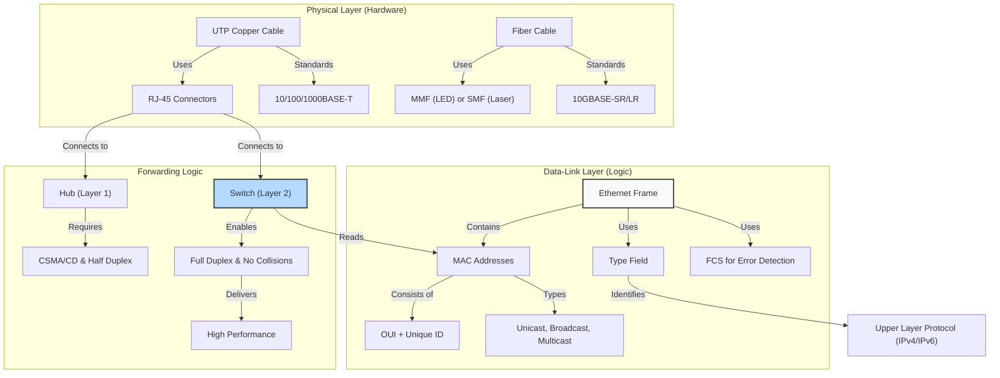

# Comprehensive Lecture: Chapter 2 – Fundamentals of Ethernet LANs

**Instructor's Note:** As an engineering student with some networking background, you already know that networks move data. But *how* does it actually happen at the hardware level? Chapter 1 gave you the "blueprint" (the TCP/IP model). Chapter 2 is where we put on our hard hats and start building the physical and data-link foundation. Think of this chapter as teaching you the **"roads, traffic lights, and license plates"** of a network. By the end, you won't just know what a cable is; you will understand *why* a specific cable works in one place but not another, and *how* a switch delivers a frame to the right computer.

---

## 1. The Big Picture: LANs, SOHO, and Enterprise Networks

Before diving into cables and signals, we must understand the *terrain* where Ethernet lives.

### 1.1 LAN vs. WAN

- **LAN (Local Area Network):** Covers a small geographic area (a room, a floor, a building). It connects devices that are "nearby."
- **WAN (Wide Area Network):** Covers a large geographic area (cities, countries). It connects LANs together.
- **The Goal:** A complete enterprise network is LANs (inside buildings) connected by WANs (between buildings/cities).

### 1.2 SOHO vs. Enterprise LANs

- **SOHO (Small Office / Home Office):**
  - **Devices:** Usually a single, all-in-one "wireless router" (which contains a router, a switch, and a wireless access point).
  - **Scale:** A handful of devices (PCs, printers, phones).
  - **Analogy:** A single-family home with one mailbox.
- **Enterprise LAN:**
  - **Devices:** Multiple dedicated switches (per floor), dedicated routers, and separate wireless access points.
  - **Scale:** Hundreds or thousands of devices.
  - **Structure:** Uses a hierarchy. Each floor has a switch (Access Layer) connecting to a central "Distribution" switch.
  - **Analogy:** A large office building with a mailroom on each floor and a central sorting facility.

**Why this matters:** The fundamental Ethernet technology is the *same* in both, but the *architecture* differs. You will configure SOHO devices differently from enterprise core switches.

---

## 2. The Physical Layer: Cabling and Connectors

Ethernet is flexible. It can run over copper wires or glass fibers. This section explains the "how" and "why" of each.

### 2.1 Copper Cabling: UTP (Unshielded Twisted Pair)

Most Ethernet cables are UTP. Think of them as the standard "network cables" you see every day.

**Key Concepts:**

- **Twisted Pairs:** Inside the cable, wires are twisted together to cancel out electromagnetic interference (EMI) and "crosstalk" (interference between wires).
- **RJ-45 Connector:** The plastic clip at the end of the cable. It has **8 pin positions** (numbered 1 to 8).
- **Standards:**
  - **10BASE-T** (10 Mbps) – Uses 2 pairs.
  - **100BASE-T (Fast Ethernet)** (100 Mbps) – Uses 2 pairs.
  - **1000BASE-T (Gigabit Ethernet)** (1000 Mbps) – Uses **4 pairs** (all 8 wires).
  - **Maximum Distance:** **100 meters** for all UTP standards.

**Engineering Context:** If your PC can't connect, and the link light is off, the first check is always the cable length (under 100m?) and the connector (are the pins pushed in?).

---

### 2.2 The "Pinout" Problem: Straight-Through vs. Crossover Cables (CRITICAL FOR CCNA!)

This is where many beginners stumble. It is a logic puzzle about **who transmits on which pin**.

**The Rule of Transmit/Receive:**

- **"MDI" Devices (PCs, Routers, WAPs):** They *transmit* on **pins 1 & 2** and *receive* on **pins 3 & 6**.
- **"MDIX" Devices (Switches, Hubs):** They *transmit* on **pins 3 & 6** and *receive* on **pins 1 & 2**. (They do the opposite!)

**The Cable Types:**

1.  **Straight-Through Cable:** Pin 1 goes to Pin 1, Pin 2 to Pin 2, etc.
    - **When to use:** When devices are of **different types** (e.g., PC to Switch, Router to Switch).
    - *Reason:* PC transmits on 1,2 -> Switch receives on 1,2. Switch transmits on 3,6 -> PC receives on 3,6. Perfect match.
2.  **Crossover Cable:** Pins 1,2 on one end connect to Pins 3,6 on the other end (they "cross" over).
    - **When to use:** When devices are of the **same type** (e.g., Switch to Switch, PC to PC, Router to Router).
    - *Reason:* If two switches both transmit on 3,6, they would be shouting at each other. The crossover swaps it so Switch A's transmit (3,6) goes to Switch B's receive (1,2).

**The Modern Savior: Auto-MDIX**
Since the introduction of Gigabit Ethernet, almost all modern devices support **Auto-MDIX**. The device automatically detects if a straight-through or crossover is needed and internally adjusts its pins. This means you can use a straight-through cable everywhere today.

- **Why learn the old rule?** The CCNA exam loves to test the *concept* of straight-through vs. crossover, and older equipment (or misconfigured devices) still exist. If Auto-MDIX is disabled or unsupported, you *must* know which cable to use.

**Quick Reference Table:**

| Connection Type  | Cable Needed (Without Auto-MDIX)            |
| :--------------- | :------------------------------------------ |
| PC to Switch     | Straight-Through                            |
| PC to PC         | Crossover                                   |
| Switch to Switch | Crossover                                   |
| Router to Switch | Straight-Through                            |
| Router to PC     | Crossover                                   |
| Switch to Hub    | Crossover (Hub acts like a PC for transmit) |

---

### 2.3 Fiber-Optic Cabling (Glass over Light)

When 100 meters is not enough, or when you have electrical interference (factories, lightning-prone areas), we use fiber optics.

**How it works:** Light pulses travel through a glass core. A layer of **cladding** reflects the light back into the core to keep it moving forward.

**The Two Main Types:**

1.  **Multimode Fiber (MMF):**
    - **Core:** Larger diameter (allows multiple "modes" or angles of light).
    - **Transmitter:** Uses LED (cheaper).
    - **Distance:** Shorter (usually up to 400m for 10G).
    - **Cost:** Cheaper.
    - **Use case:** Inside a building or between buildings on the same campus.
2.  **Single-Mode Fiber (SMF):**
    - **Core:** Very small diameter (allows only one "mode" of light).
    - **Transmitter:** Uses LASER (more expensive).
    - **Distance:** Very long (up to 40km or more).
    - **Cost:** More expensive.
    - **Use case:** Long-haul connections between cities or across large campuses.

**Tradeoff Summary (Table 2-5):**

- **UTP:** Cheapest, limited to 100m, susceptible to EMI, emits faint signals (security risk).
- **Multimode:** Mid-cost, longer distance (hundreds of meters), immune to EMI.
- **Single-Mode:** Most expensive, longest distance (kilometers), immune to EMI.

---

## 3. The Data-Link Layer: The Ethernet Frame

Remember encapsulation from Chapter 1? The Data-Link layer adds its header and trailer to the IP packet to create a **Frame**.

### 3.1 The Ethernet Frame Format

Look at Figure 2-18 in your book. The key fields to know for CCNA are:

| Field                | Location | Size          | Purpose                                                      |
| :------------------- | :------- | :------------ | :----------------------------------------------------------- |
| **Preamble / SFD**   | Header   | 8 Bytes       | Synchronization – "Hey, a frame is coming!"                  |
| **Dest MAC**         | Header   | 6 Bytes       | **Who** is this for? (The receiver's hardware address).      |
| **Src MAC**          | Header   | 6 Bytes       | **Who** sent this? (The sender's hardware address).          |
| **Type (EtherType)** | Header   | 2 Bytes       | **What** is inside? (e.g., `0x0800` for IPv4, `0x86DD` for IPv6). |
| **Data + Pad**       | Payload  | 46–1500 Bytes | The actual IP Packet (or other Layer 3 data). Padding is added to meet the minimum length of 46 bytes. |
| **FCS**              | Trailer  | 4 Bytes       | **Error Detection** (not recovery).                          |

**Critical Concept: The EtherType Field**
This field is the "glue" between Layer 2 (Data-Link) and Layer 3 (Network). When a switch or PC receives this frame, it looks at the EtherType to know which process to hand the data to. If it says `0x0800`, it unpacks the data and sends it to the IPv4 process.

### 3.2 Error Detection: The FCS (Frame Check Sequence)

- The sender runs a mathematical formula (CRC) on the frame and stores the result in the FCS.
- The receiver runs the *same* formula on the received frame.
- **If the results match:** The frame is clean. It is processed.
- **If the results differ:** The frame is corrupt. The receiver **discards** it.
- **Important:** Ethernet does **NOT** recover lost frames. Recovery is the job of higher layers (like TCP). Ethernet is "best effort."

---

## 4. The "License Plate": Ethernet MAC Addresses

Every device needs a unique hardware identifier to know who is who on the LAN. This is the MAC address.

### 4.1 Anatomy of a MAC Address

- **Length:** 48 bits (6 bytes). Displayed as 12 Hex digits (e.g., `0000.0C12.3456`).
- **Structure:**
  - **First 3 Bytes (24 bits):** The **OUI (Organizationally Unique Identifier)**. This identifies the manufacturer (e.g., Cisco, Intel).
  - **Last 3 Bytes (24 bits):** Assigned by the manufacturer uniquely to that specific NIC.
- **Analogy:** Think of the OUI as your "Car Manufacturer Code" and the last 3 bytes as your "Vehicle Identification Number (VIN)". No two cars in the world should have the exact same VIN.

### 4.2 Terminology

- **BIA (Burned-in Address):** The permanent MAC address "burned" into the ROM chip of the NIC. You cannot change it (though you can override it in software).
- **Unicast Address:** Represents a **single** specific NIC. (Normal communication).
- **Broadcast Address:** `FFFF.FFFF.FFFF`. This frame is delivered to **ALL** devices on the LAN.
- **Multicast Address:** Delivered to a **group** of devices that have "subscribed" to receive it (e.g., streaming video or routing protocol updates).

**Key Insight:** IP addresses (from Chapter 1) are like your "home address" (logical, changeable). MAC addresses are like your "fingerprint" (physical, permanent). Switches use MAC addresses to forward frames *within* the LAN. Routers use IP addresses to forward packets *between* LANs.

---

## 5. Sending Frames: Switches vs. Hubs, Full Duplex vs. Half Duplex

Now we know *what* a frame is and *what* addresses look like. How does the hardware actually forward it?

### 5.1 The Evolution: Hub (Layer 1) vs. Switch (Layer 2)

- **Hub (Obsolete, but tested):** A "dumb" repeater. It works at Layer 1 (Physical). When a signal comes in one port, it blindly repeats it out *every other port*.
  - **Problem:** If two devices send at the same time, their signals collide.
  - **Requirement:** Devices must use **Half Duplex** and **CSMA/CD** to manage collisions.
- **Switch (Modern):** A "smart" device. It works at Layer 2 (Data-Link). It reads the Destination MAC address, checks its internal MAC address table, and forwards the frame *only* out the specific port where the destination device lives.
  - **Benefit:** Collisions are isolated (each port is a separate collision domain).
  - **Requirement:** Devices can use **Full Duplex**.

### 5.2 CSMA/CD (Carrier Sense Multiple Access with Collision Detection)

*Use this only for Half-Duplex (Hubs).*

1.  **Carrier Sense:** "Listen" before you speak. Is the wire quiet?
2.  **Multiple Access:** Many devices share the same wire.
3.  **Collision Detection:** If you speak at the same time as someone else, you hear the "noise" (collision). You send a "jamming signal" to tell everyone.
4.  **Backoff:** You wait a random amount of time (exponential backoff) and try again.

### 5.3 Half Duplex vs. Full Duplex

- **Half Duplex (Hubs):** Walkie-Talkie. You can either speak or listen, but not at the same time. Uses CSMA/CD. Only one device can send on the segment at a time.
- **Full Duplex (Switches):** Telephone. You can speak and listen simultaneously. No collisions. No CSMA/CD. Doubles the effective bandwidth (you can send and receive at 100 Mbps simultaneously, effectively 200 Mbps throughput).

**Rule of Thumb:** In a modern network, **everything should be Full Duplex**. If you connect a switch port to a hub, the switch port MUST be set to Half Duplex. If you leave it on Full Duplex (or Auto-negotiate fails), you will get a "duplex mismatch" – the hub thinks it's half, the switch thinks it's full, causing massive collisions and slow speeds. This is a common real-world troubleshooting scenario!

---

## 6. Concept Relationship Map (Mermaid)

This map shows how the physical components support the logical data-link functions, which enable the network layer.

---

## 7. Connection to Other Chapters

- **Chapter 1 (TCP/IP Model):** This chapter is the "implementation" of the Data-Link and Physical layers mentioned in Chapter 1.
- **Chapter 3 & 4 (WANs & Routing):** You will learn how Routers (Layer 3) connect LANs to WANs. They use the Ethernet frames we just learned to talk to the local switch.
- **Chapters 5-7 (VLANs and Switching):** Now that you know how a *single* switch works, future chapters will teach you how to split one switch into multiple virtual LANs (VLANs) and connect multiple switches together (Trunking). Your understanding of MAC addresses and Frames is essential for this.
- **Volume 2 (Wireless):** Wireless LANs (Wi-Fi) also use MAC addresses! The frame format is slightly different, but the addressing logic is the same.

---

## 8. Summary, Key Takeaways & Study Advice

### 8.1 Core Takeaways

1.  **UTP is standard, Fiber is special:** UTP = 100m, cheap. MM = hundreds of meters, mid-cost. SM = kilometers, expensive.
2.  **Straight-through vs Crossover:** Know the rule! **Unlike** devices = Straight-through. **Like** devices = Crossover (if no Auto-MDIX).
3.  **The Frame is King:** Master the fields: MAC addresses (who), Type (what inside), FCS (error check).
4.  **MAC Addresses:** 6 bytes. OUI is the vendor. Must be unique on the LAN.
5.  **Switches are smarter than Hubs:** Switches enable Full-Duplex and eliminate collisions, making networks faster. Hubs force Half-Duplex and CSMA/CD.

### 8.2 Common Pitfalls for Students

- **Confusing Straight-through vs Crossover:** Do not memorize "PC to Switch is Straight." Memorize the *rule* (same type = cross, different = straight). The exam will give you odd pairings (like Router to PC).
- **Thinking FCS recovers data:** It *detects* errors and discards the frame. It does NOT resend it. That is TCP's job (Layer 4).
- **Mixing up IP and MAC:** Remember: **MAC** addresses are for the local LAN (Layer 2). **IP** addresses are for end-to-end routing across the internet (Layer 3). A switch doesn't care about IP; it cares about MAC.
- **Duplex Mismatch:** If you use a hub, the switch port MUST be set to Half-Duplex. Auto-negotiation usually handles this, but if a user manually sets a PC to 100/Full while the switch is on Auto, the switch might fall back to 100/Half, causing a mismatch. **Always use Auto for speed and duplex unless absolutely forced not to.**

### 8.3 Deep Learning Advice

1.  **Walk around your home/dorm:** Look at the back of your PC or router. Identify the RJ-45 connector, the UTP cable, and the link lights. Trace the cable back to the wall. Look at the switch it connects to.
2.  **Inspect a cable:** Look at the RJ-45 connector. Can you see the 8 pins? Notice the colors. If you have a cable tester, try it out.
3.  **Command Line:** On your Windows PC, open Command Prompt and type `ipconfig /all`. Find your "Physical Address" – that is your MAC address. Type `arp -a` to see a table of IP addresses mapped to MAC addresses for devices on your local network! This shows the exact Layer 2 to Layer 3 mapping we discussed.
4.  **Wireshark (Again):** Open Wireshark and capture a ping to your router. Expand the Ethernet frame. Look at the Destination MAC, Source MAC, and Type (which should be `0x0800` for IPv4). Seeing this visually will cement the frame structure in your mind.

This chapter is the bridge between abstract theory (Chapter 1) and practical configuration (Chapters 5+). Solidify your understanding of the Ethernet frame and MAC addresses now, and the rest of the CCNA will feel much more natural!
---

## Appendix: Professional Terminology (Chinese Translation)

| English Term                             | Chinese Translation               |
| :--------------------------------------- | :-------------------------------- |
| 10BASE-T / 100BASE-T / 1000BASE-T        | 10BASE-T / 100BASE-T / 1000BASE-T |
| Access Point (AP)                        | 接入点                            |
| Auto-MDIX                                | 自动介质相关接口交叉              |
| Broadcast Address                        | 广播地址                          |
| Burned-In Address (BIA)                  | 烧录地址                          |
| Cladding                                 | 包层                              |
| Collision                                | 冲突                              |
| Collision Domain                         | 冲突域                            |
| Core                                     | 纤芯                              |
| Crossover Cable                          | 交叉线                            |
| CSMA/CD                                  | 载波监听多路访问/冲突检测         |
| Distribution Switch (SWD)                | 分布交换机                        |
| Electromagnetic Interference (EMI)       | 电磁干扰                          |
| Encoding Scheme                          | 编码方案                          |
| Ethernet Frame                           | 以太网帧                          |
| Fast Ethernet                            | 快速以太网                        |
| Fiber-Optic Cable                        | 光纤线缆                          |
| Frame Check Sequence (FCS)               | 帧校验序列                        |
| Full Duplex                              | 全双工                            |
| Gigabit Ethernet                         | 千兆以太网                        |
| Half Duplex                              | 半双工                            |
| Hub                                      | 集线器                            |
| IEEE 802.3                               | IEEE 802.3标准                    |
| Jamming Signal                           | 阻塞信号                          |
| Layer 1 / Layer 2 Switch                 | 一层/二层交换机                   |
| MAC Address                              | MAC地址                           |
| Maximum Transmission Unit (MTU)          | 最大传输单元                      |
| Multimode Fiber (MM)                     | 多模光纤                          |
| Network Interface Card (NIC)             | 网卡                              |
| Organizationally Unique Identifier (OUI) | 组织唯一标识符                    |
| Point-to-Point                           | 点对点                            |
| Preamble                                 | 前导码                            |
| RJ-45 Connector                          | RJ-45连接器                       |
| Router                                   | 路由器                            |
| Shared Media                             | 共享介质                          |
| Single-Mode Fiber (SM)                   | 单模光纤                          |
| Start Frame Delimiter (SFD)              | 帧起始定界符                      |
| Straight-Through Cable                   | 直通线                            |
| Transceiver                              | 收发器                            |
| Type Field / EtherType                   | 类型字段                          |
| Unicast Address                          | 单播地址                          |
| Unshielded Twisted-Pair (UTP)            | 非屏蔽双绞线                      |
| Wired LAN                                | 有线局域网                        |
| Wireless LAN                             | 无线局域网                        |
