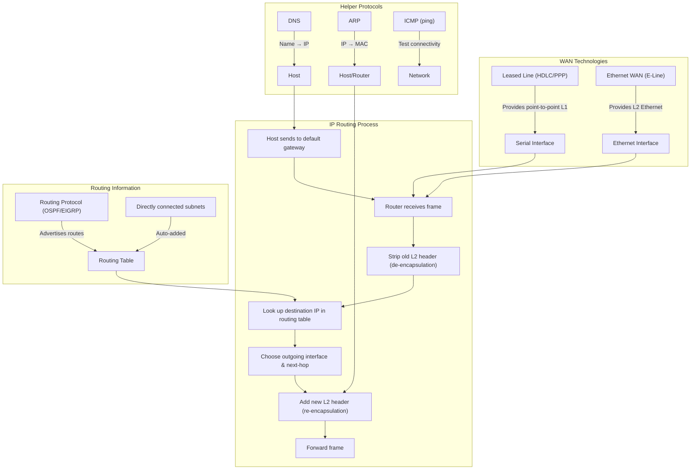

# Comprehensive Lecture: Chapter 3 – Fundamentals of WANs and IP Routing

## 1. WAN Fundamentals: Connecting Distant Sites

### 1.1 Why We Need WANs

A LAN is great for a single building, but a company with multiple offices needs to connect them. A **Wide‑Area Network (WAN)** is a network that spans a large geographic area (e.g., city, country, or even globally). The service provider (telco) installs and maintains the WAN links; the enterprise just connects its routers to these links.

**Analogy:** Think of LANs as the roads inside a neighborhood. WANs are the interstates that connect different cities. Your router is like the on‑ramp that connects your neighborhood road to the interstate.

### 1.2 Two Key WAN Technologies for CCNA

The CCNA exam focuses on two WAN types:

1. **Leased‑line WANs** (older, but still tested)
2. **Ethernet WANs** (modern, widely used)

---

## 2. Leased‑Line WANs

### 2.1 What Is a Leased Line?

A leased line is a **point‑to‑point** physical circuit that the telco provisions between two customer sites. It behaves like a dedicated cable – but in reality, the telco uses a complex network to simulate that cable.

**Key characteristics:**

- **Full‑duplex** (can send and receive simultaneously)
- **Fixed speed** (e.g., 1.544 Mbps for T1, 2.048 Mbps for E1)
- **Private** – no other customer shares your circuit (hence "private line")
- **Always on** – no dial‑up

**Common names:** leased circuit, private line, serial link, point‑to‑point link, T1 (in the US).

**Analogy:** It's like having a dedicated phone line that connects your office directly to another office – you pay a monthly fee, and the line is yours alone.

### 2.2 Physical Layer and Cabling

The telco installs cabling from your router to its nearest **Point of Presence (PoP)** . Inside the telco's network, they may use fiber, microwave, or other technologies, but to you it looks like a single cable. The router uses a **serial interface** (with various connector types) and often a **CSU/DSU** (Channel Service Unit / Data Service Unit) to convert digital signals to the telco's format.

### 2.3 Data‑Link Layer on Leased Lines

The leased line provides only Layer 1 (physical) service – it just sends bits. The routers on each end must use a **data‑link protocol** to manage framing, error detection, and identification of the payload. Two common protocols:

- **HDLC (High‑Level Data Link Control)** – the default on Cisco routers. It is simple and works well for point‑to‑point links.
- **PPP (Point‑to‑Point Protocol)** – more modern, supports authentication (PAP/CHAP), multilink, and other features.

**Comparison with Ethernet:**

- No need for MAC addresses because there are only two devices on the link (point‑to‑point). The Address field is ignored.
- They still have a **Type field** to identify the Layer 3 protocol (e.g., IPv4 or IPv6) inside the frame.
- They also have an **FCS (Frame Check Sequence)** for error detection.

**Frame format:** HDLC and PPP both have a Flag, Address, Control, Type, Data, and FCS. The Control field is rarely used today.

**Analogy:** Imagine a private road with only two houses. You don't need house numbers – you know that any package you send goes to the other house. But you still need a box (frame) with a label saying what's inside (Type) and a checksum (FCS) to ensure it wasn't damaged.

---

## 3. Ethernet WANs (The Modern Choice)

### 3.1 Why Ethernet for WAN?

Ethernet has evolved far beyond 100 meters. With fiber standards like **1000BASE‑LX** (5 km) and **1000BASE‑ZX** (70 km), Ethernet can now cover WAN distances. Service providers offer **Ethernet WAN** services – often called **E‑Line** (Ethernet Line) or **EoMPLS** (Ethernet over MPLS).

### 3.2 How It Works

Your router connects to the provider's network via a fiber Ethernet link (usually using an SFP/SFP+ transceiver). The provider's switch then forwards your Ethernet frames across their infrastructure to the remote site. Logically, it appears as a **point‑to‑point Ethernet link** between your two routers.

**Key difference from leased line:** The data‑link protocol is **Ethernet** (802.3) – the same as in a LAN. So your router uses an Ethernet interface and MAC addresses, even though the link spans miles.

**Analogy:** It's like having a very long Ethernet cable that runs between two buildings, but the provider manages the middle part using their own equipment.

### 3.3 Encapsulation Over Ethernet WAN

When a router forwards an IP packet over an Ethernet WAN, it encapsulates it in an **Ethernet frame** with source and destination MAC addresses. The source MAC is the router's own Ethernet WAN interface; the destination MAC is the remote router's MAC on that link.

**Important:** The router **discards the old data‑link header** (e.g., from the LAN) and **creates a new one** for the WAN link. This is the heart of routing – the IP packet remains unchanged, but the frame is rebuilt for each hop.

---

## 4. IP Routing: The Network Layer in Action

Now we move from the physical and data‑link layers to the **network layer** – the "brain" that decides where packets should go.

### 4.1 What Is IP Routing?

**IP routing** (or IP forwarding) is the process by which a router examines the **destination IP address** of an incoming packet, looks up its **routing table**, and determines the best **next‑hop** router or interface to send the packet toward its final destination.

**Host vs. Router:**

- A **host** (PC, server) only needs to know if the destination is on its own subnet. If yes, it sends directly; otherwise, it sends the packet to its **default gateway (default router)** .
- A **router** has a routing table with many entries (routes) and can forward packets across multiple hops.

**Analogy:** You are at home (PC). If your friend lives on the same street, you walk directly. If they live in another city, you go to the nearest highway entrance (default gateway). The highway system (routers) then directs you to the correct exit.

### 4.2 The Routing Decision – Step by Step

When a router receives a frame:

1. **Check FCS** – if errors, discard the frame.
2. **Strip off the data‑link header/trailer** – leaving the IP packet.
3. **Look at the destination IP address** – match it to the longest prefix in the routing table.
4. **Find the outgoing interface and next‑hop IP** (if any).
5. **Encapsulate the IP packet in a new data‑link frame** appropriate for that outgoing interface (Ethernet, HDLC, PPP, etc.).
6. **Send the frame** out that interface.

**Crucial:** The IP packet (including source/destination IP addresses) remains **unchanged** throughout the journey. Only the data‑link headers change at each hop.

### 4.3 Example of Routing and Encapsulation (Figure 3‑11)

Let's trace a packet from PC1 (on Ethernet) to PC2 (on another Ethernet), with three routers (R1, R2, R3) connected by WAN links.

- **PC1** creates an IP packet with dest = PC2's IP. Since PC2 is not on the same subnet, PC1 sends the packet to its default router R1, using an Ethernet frame with destination MAC = R1's MAC.
- **R1** receives the frame, checks FCS, strips the Ethernet header, looks up the dest IP in its routing table, finds a route pointing to Serial0 (HDLC) with next‑hop R2. So R1 encapsulates the IP packet in an **HDLC frame** and sends it to R2.
- **R2** receives the HDLC frame, strips it, looks up the dest IP, finds a route out its FastEthernet interface (Ethernet WAN) to R3. It encapsulates in a new **Ethernet frame** with dest MAC = R3's MAC on that WAN link.
- **R3** receives the Ethernet frame, strips it, looks up the dest IP, finds a directly connected subnet (PC2's LAN). So it encapsulates in an **Ethernet frame** with destination MAC = PC2's MAC and sends it directly to PC2.

**Key takeaway:** Each router performs **de‑encapsulation** (removing old header) and **re‑encapsulation** (adding new header). The IP packet is untouched.

---

## 5. IP Addressing and Subnetting (Fundamentals)

### 5.1 How IP Addresses Are Grouped

IP addresses are 32‑bit numbers, usually written in dotted‑decimal (e.g., 150.150.1.10). To make routing efficient, addresses are grouped into **networks** and **subnets**. All devices on the same physical segment must belong to the same subnet.

**Rules:**

- Two devices that are **not separated by a router** must have addresses in the **same subnet**.
- Two devices that are **separated by at least one router** must have addresses in **different subnets**.

**Analogy:** Postal ZIP codes – houses on the same street have the same ZIP code, but a different city has a different ZIP code. Routers are like sorting facilities that only need to know which ZIP code a package belongs to, not every individual address.

### 5.2 The IP Header

The IPv4 header (20 bytes minimum) contains key fields:

- **Source IP Address** (32 bits)
- **Destination IP Address** (32 bits)
- **Time‑to‑Live (TTL)** – to prevent looping
- **Protocol** – indicates which transport layer protocol (TCP=6, UDP=17, ICMP=1)
- **Header Checksum** – for error detection on the header only

The routing process does **not** modify the source/destination IP addresses; only the TTL is decremented at each hop.

---

## 6. Routing Protocols: How Routers Learn Routes

A router can have static routes configured manually, but in a large network, we use **routing protocols** to dynamically learn routes.

### 6.1 Purpose of Routing Protocols

A routing protocol allows routers to **exchange information** about reachable subnets so that each router can build a complete and up‑to‑date routing table.

### 6.2 Basic Steps (Figure 3‑13)

1. Each router adds a **directly connected route** for every subnet attached to its interfaces (no protocol needed).
2. Routers send **routing updates** (advertisements) to their neighbors, listing all known routes.
3. Neighbors learn these routes, add them to their tables, and then advertise them to their own neighbors.
4. If multiple routes to the same subnet exist, routers choose the best one based on a **metric** (e.g., hop count, bandwidth, delay).

**Example:** In the figure, R3 has subnet 150.150.4.0 directly connected. It advertises it to R2. R2 learns it and advertises to R1. Eventually, R1 knows that subnet is reachable via R2.

### 6.3 Common Routing Protocols (CCNA scope)

- **RIP** (obsolete) – uses hop count.
- **OSPF** – link‑state, uses cost (bandwidth).
- **EIGRP** – Cisco proprietary, uses composite metric.
- **BGP** – used between autonomous systems (Internet).

This book later covers OSPF and EIGRP in detail.

---

## 7. Other Network Layer Helper Protocols

IP itself is not the only network layer protocol; these supporting protocols make life easier.

### 7.1 DNS – Domain Name System

Users prefer names like `www.cisco.com` over IP addresses. **DNS** translates hostnames to IP addresses.

**Process:**

1. Your PC sends a DNS query to a DNS server.
2. The server replies with the IP address.
3. Your PC then uses that IP address to communicate.

**Analogy:** It's like a phone book – you look up a person's name to find their phone number.

### 7.2 ARP – Address Resolution Protocol

When a host or router wants to send an IP packet over an Ethernet LAN, it needs the **destination MAC address**. ARP finds it dynamically.

**ARP Request:** Broadcast on the LAN – "Who has IP address X? Please send me your MAC."
**ARP Reply:** Unicast – "I have IP X, my MAC is Y."

The sender then caches the mapping in its **ARP cache** (or ARP table) for future use.

**Analogy:** You know your friend's apartment number (IP) but not their door code (MAC). You shout in the building (ARP broadcast) and they reply with their code.

### 7.3 Ping and ICMP

**ping** is a diagnostic tool that tests basic IP connectivity. It uses **ICMP (Internet Control Message Protocol)** :

- Sends an **ICMP Echo Request** to a destination.
- The destination replies with an **ICMP Echo Reply**.
- If you get a reply, the IP path is working (Layers 1‑3 are OK).

**Other ICMP uses:** Error reporting (e.g., Destination Unreachable, Time Exceeded).

---

## 8. Concept Relationship Map (Mermaid)

This diagram shows how WAN links, routing, and helper protocols all fit together.

---

## 9. Connections to Previous and Future Chapters

- **Chapter 1 (TCP/IP model):** This chapter fleshes out the Network layer (IP) and shows how it uses the Data‑Link layer (LAN/WAN) for delivery.
- **Chapter 2 (Ethernet LANs):** We build on Ethernet framing and MAC addresses; now we see how routers use those concepts on WAN links as well.
- **Future chapters (Part IV, V, VI):** You will dive deep into IP addressing/subnetting, static routing, and dynamic routing protocols (OSPF, EIGRP). This chapter gives you the "big picture" of routing – essential for those deeper topics.
- **Volume 2:** You'll revisit WAN technologies like MPLS and VPNs, but the basics here remain foundational.

---

## 10. Summary, Key Takeaways & Study Advice

### 10.1 Core Takeaways

1. **WANs connect distant sites** – two main types: leased lines (HDLC/PPP) and Ethernet WANs (E‑Line).
2. **Routing = forwarding packets based on destination IP** – routers strip and add data‑link headers at each hop.
3. **The IP packet is never changed** – only the frame changes.
4. **Routing protocols** let routers learn routes automatically – they advertise subnets to neighbors.
5. **Hosts use default gateway** for off‑subnet traffic.
6. **Supporting protocols:** DNS (names → IP), ARP (IP → MAC), ICMP (test connectivity).

### 10.2 Common Pitfalls for Students

- **Confusing routing and switching** – routing uses IP addresses (Layer 3), switching uses MAC addresses (Layer 2). A router changes the frame, a switch does not.
- **Thinking that the IP header changes at each hop** – it does not! Only the TTL decrements.
- **Forgetting that hosts also make routing decisions** – they decide whether to send directly or to the default gateway.
- **Mixing up HDLC and PPP** – both are used on serial links; PPP has more features (authentication), HDLC is simpler.
- **Assuming Ethernet WAN uses MAC addresses from the LAN** – the WAN link has its own separate MAC addresses; the router uses a new source/destination MAC for that link.

### 10.3 Deep Learning Advice

1. **Trace a packet manually** – draw a topology with three routers and two PCs. Write down the source/dest IP and MAC at each step. This forces you to understand encapsulation changes.
2. **Use `tracert` (Windows) or `traceroute` (Linux/Cisco)** – this shows the route a packet takes, reinforcing the hop‑by‑hop forwarding.
3. **Check your ARP cache** – on your PC, run `arp -a` to see the IP‑to‑MAC mappings of devices on your local LAN.
4. **Ping** – try pinging your default gateway, then a remote IP. If that works, DNS is not needed for basic connectivity.
5. **Simulate with Packet Tracer or GNS3** – build a small network with routers and enable OSPF. Watch the routing tables update.

---

## Appendix A: Network Device Commands (Reference)

This chapter does not introduce Cisco IOS configuration commands, but you will encounter these show/debug commands later. For now, become familiar with these **user‑level commands** (available on PCs and routers).

| Command                                             | Description                                                |
| :-------------------------------------------------- | :--------------------------------------------------------- |
| `ping <ip‑address>`                                 | Sends ICMP Echo Requests to test reachability.             |
| `traceroute <ip‑address>` (or `tracert` on Windows) | Shows the path (each router hop) to the destination.       |
| `arp -a` (Windows) / `arp` (Linux)                  | Displays the ARP cache (IP → MAC mappings).                |
| `ipconfig /all` (Windows) / `ifconfig` (Linux)      | Shows IP address, MAC, default gateway, DNS servers.       |
| `show ip route` (Cisco IOS)                         | Displays the routing table (will learn in later chapters). |
| `show interfaces` (Cisco IOS)                       | Shows status and MAC addresses of all interfaces.          |

---

## Appendix B: Glossary of Key Terms (English – Chinese)

| English Term                | Chinese Translation | Brief Explanation                                            |
| :-------------------------- | :------------------ | :----------------------------------------------------------- |
| **Wide‑Area Network (WAN)** | 广域网              | A network spanning large geographic areas.                   |
| **Leased line**             | 专线 / 租用线路     | A dedicated point‑to‑point circuit from a service provider.  |
| **Serial interface**        | 串行接口            | A router interface used for leased lines (e.g., T1/E1).      |
| **HDLC**                    | 高级数据链路控制    | A simple data‑link protocol for point‑to‑point links.        |
| **PPP**                     | 点对点协议          | A more feature‑rich data‑link protocol.                      |
| **Ethernet WAN**            | 以太网广域网        | Using Ethernet as a WAN technology, often with fiber.        |
| **E‑Line**                  | 以太网专线          | MEF term for point‑to‑point Ethernet WAN service.            |
| **IP routing**              | IP路由              | Forwarding packets based on destination IP address.          |
| **Routing table**           | 路由表              | A table in a router listing known subnets and next‑hops.     |
| **Default gateway**         | 默认网关            | The router a host sends off‑subnet traffic to.               |
| **De‑encapsulation**        | 解封装              | Removing a data‑link header/trailer to extract the IP packet. |
| **Re‑encapsulation**        | 重新封装            | Adding a new data‑link header/trailer for the next hop.      |
| **Subnet**                  | 子网                | A group of IP addresses that are on the same physical segment. |
| **Routing protocol**        | 路由协议            | A protocol (e.g., OSPF) that exchanges route information between routers. |
| **DNS**                     | 域名系统            | Translates hostnames to IP addresses.                        |
| **ARP**                     | 地址解析协议        | Finds a MAC address from an IP address on a local network.   |
| **ICMP**                    | 互联网控制消息协议  | Used for error reporting and diagnostics (e.g., ping).       |
| **ping**                    | ping命令            | A tool that tests basic IP connectivity.                     |
| **Telco**                   | 电信公司            | A service provider that offers WAN links.                    |
| **Point of Presence (PoP)** | 入网点              | The provider's local facility where customer connections terminate. |
