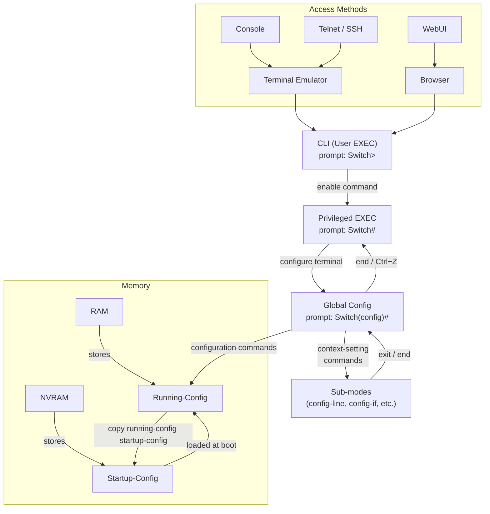

# Comprehensive Lecture: Chapter 4 – Using the Command‑Line Interface

## 1. Why This Chapter Matters

The CCNA exam requires you to **identify, configure, and verify** switch features. Before you can configure VLANs, spanning tree, or port security, you must know how to access the device, enter commands, and save your work. This chapter provides the **foundational skills** that you will use in every subsequent lab and exam simulation. Without these skills, you cannot perform any practical networking task.

---

## 2. Accessing the CLI – The Front Door

Imagine a switch as a secure building. There are three main entrances for administrators:

| Access Method          | How It Works                                                 | Security                                          |
| :--------------------- | :----------------------------------------------------------- | :------------------------------------------------ |
| **Console**            | A physical cable (usually USB or old serial) directly from your PC to the switch’s console port. | Physical access required; by default no password. |
| **Telnet**             | Network‑based, using TCP port 23. All data (including passwords) is sent as plain text. | **Insecure** – never use in production.           |
| **SSH (Secure Shell)** | Network‑based, using TCP port 22. All data is **encrypted**, including login credentials. | **Secure** – the standard for remote access.      |

**Analogy:** Console is like a private door to the building’s control room (you must be physically present). Telnet and SSH are like remote controls; SSH is a secure encrypted radio, while Telnet is an open walkie‑talkie where anyone can listen.

### 2.1 Console Connection Details

- **Physical cable:** Modern switches use a USB‑to‑mini‑USB cable; older ones use an RJ‑45 “rollover” cable (pin 1 to pin 8, pin 2 to pin 7, etc.) with a DB‑9 adapter.
- **Terminal emulator software** (e.g., PuTTY, TeraTerm, or the built‑in terminal) must be configured with **default settings**:  
  - 9600 bits per second  
  - 8 data bits  
  - No parity  
  - 1 stop bit  
  - No flow control  
- These settings are like a “handshake” between your PC and the switch – both must agree on the speed and format.

### 2.2 Telnet and SSH

- **Telnet:** Enabled by default on Cisco switches but requires a password (VTY line password) to allow login. Because it sends everything in clear text, it is only used in labs.
- **SSH:** More secure; requires additional configuration (hostname, domain name, RSA keys). Chapter 6 will show the full setup.

### 2.3 WebUI – A Graphical Alternative

Cisco switches also offer a web‑based interface (HTTP/HTTPS) called the **WebUI**. You can open a browser, enter the switch’s IP address, and perform configuration and monitoring with point‑and‑click. It even includes a built‑in CLI window (see Figure 4‑10). However, most engineers prefer a dedicated SSH client for speed and comfort.

---

## 3. CLI Modes – The Control Levels

Once you are logged in, you are placed in a specific **mode**. Each mode allows a different set of commands. The prompt tells you which mode you are in.

| Mode                              | Prompt Example                                     | Purpose                                                      | How to Enter                                                 |
| :-------------------------------- | :------------------------------------------------- | :----------------------------------------------------------- | :----------------------------------------------------------- |
| **User EXEC** (user mode)         | `Switch>`                                          | Basic monitoring, no configuration changes.                  | Default after login.                                         |
| **Privileged EXEC** (enable mode) | `Switch#`                                          | Full monitoring, reload, debug, and access to configuration. | Type `enable` and provide password (if set).                 |
| **Global Configuration**          | `Switch(config)#`                                  | Commands that affect the entire device (hostname, enable secret). | From enable mode, type `configure terminal`.                 |
| **Sub‑configuration modes**       | `Switch(config‑line)#`, `Switch(config‑if)#`, etc. | Commands for a specific component (console line, an interface, a VLAN). | Use context‑setting commands like `line console 0` or `interface GigabitEthernet 0/1`. |

**Analogy:**  

- User mode = looking at a dashboard (you can read gauges).  
- Enable mode = being the driver (you can start/stop the engine).  
- Global config = designing the car’s overall layout.  
- Interface config = tuning a specific wheel.

**Important:** Only **EXEC commands** (like `show`, `reload`, `enable`) are typed in user/enable modes. **Configuration commands** (like `hostname`, `speed`) are typed only in configuration modes.

---

## 4. CLI Help and Shortcuts

Cisco IOS provides built‑in help so you don’t have to memorize every command.

| What You Type                        | Result                                                 |
| :----------------------------------- | :----------------------------------------------------- |
| `?` (alone)                          | Lists all commands available in the current mode.      |
| `show ?`                             | Lists all possible sub‑options for the `show` command. |
| `show mac-address?`                  | Shows commands that start with “mac‑address”.          |
| `show mac-address-table ?`           | Lists the next parameters (e.g., `dynamic`, `static`). |
| `show mac-address-table dyn` + `Tab` | Autocompletes to `dynamic` if unique.                  |
| Up/Down arrow keys                   | Recall previously entered commands (history buffer).   |
| Ctrl+A / Ctrl+E                      | Jump to start/end of the line.                         |

**Practical tip:** When in doubt, use `?`. The CLI will not execute the command with `?` – it just displays help. The `?` is your best friend.

---

## 5. Show vs. Debug

- **`show` commands** take a **snapshot** of the current status (like a photograph). They are safe and can be run in any mode.
  - Example: `show mac address-table` – displays the MAC address table (used by the switch to forward frames).
- **`debug` commands** provide **real‑time** event reporting (like a live video feed). They can generate a lot of output and affect performance, so they should be used sparingly and only in enable mode.
  - Example: `debug ip packet` – shows every packet processed.
- Always turn off debugging with `undebug all` when done.

---

## 6. Configuration Process – Changing the Running Configuration

When you enter configuration mode and type a command, the change is **immediate** – it takes effect right away. This active configuration is stored in **RAM** and is called the **running‑config**.

**Key memory types in a switch:**

| Memory         | Contents                                   | Volatile?               |
| :------------- | :----------------------------------------- | :---------------------- |
| **RAM** (DRAM) | Running‑config, routing tables, MAC tables | Yes (lost on power off) |
| **NVRAM**      | Startup‑config (saved configuration)       | No (retained)           |
| **Flash**      | IOS image file (the operating system)      | No                      |
| **ROM**        | Bootstrap program (for initial boot)       | No                      |

**Analogy:**  

- RAM = your working desk (current changes).  
- NVRAM = your filing cabinet (permanent storage).  
- Flash = the library where the OS book is stored.  
- ROM = the instruction manual to start the boot process.

### 6.1 The Two Configuration Files

- **Running‑config** – the active configuration in RAM. All changes go here immediately.
- **Startup‑config** – the saved configuration in NVRAM. Loaded when the switch boots.

When you configure, you update the running‑config **only**. If you reload the switch without saving, all your changes are lost.

---

## 7. Saving and Erasing Configuration

### 7.1 Saving the Configuration

To make your changes permanent, you must **copy** the running‑config to the startup‑config:

```
Switch# copy running-config startup-config
```

(Alternatively, `write memory` works on many devices.)

After this, the next reboot will load your saved configuration.

### 7.2 Erasing the Configuration (Start Over)

To wipe the startup‑config (i.e., return to factory defaults), use:

```
Switch# erase startup-config
```

or

```
Switch# write erase
```

Then **reload** the switch (`reload` command). The switch will boot with no configuration (or with a default configuration). Note that **there is no command to erase the running‑config** directly – you erase the startup‑config and reload; the running‑config then becomes empty.

---

## 8. Navigating Configuration Submodes

In configuration mode, you can move between different contexts using **context‑setting commands**. The prompt changes to show your current context.

| Command to Enter                | Prompt After           | Mode Name                       |
| :------------------------------ | :--------------------- | :------------------------------ |
| `line console 0`                | `Switch(config‑line)#` | Line configuration (console)    |
| `line vty 0 15`                 | `Switch(config‑line)#` | Line configuration (Telnet/SSH) |
| `interface GigabitEthernet 0/1` | `Switch(config‑if)#`   | Interface configuration         |
| `vlan 10`                       | `Switch(config‑vlan)#` | VLAN configuration              |

To return to the previous mode, use **`exit`**. To jump directly back to enable mode from any submode, use **`end`** or press **Ctrl+Z**.

**Example flow (from Example 4‑4):**

```
Switch# configure terminal
Switch(config)# hostname Fred
Fred(config)# line console 0
Fred(config‑line)# password hope
Fred(config‑line)# exit
Fred(config)# interface FastEthernet 0/1
Fred(config‑if)# speed 100
Fred(config‑if)# end
Fred#
```

---

## 9. Security at the Console

By default, the console port does **not** require a password. To enable password checking, you must configure:

```
line console 0
 login
 password faith
```

And to require a password to enter enable mode:

```
enable secret love
```

The `enable secret` command stores the password in an encrypted form. It is used whenever you type `enable` from user mode.

**Important:** The console password is stored in plain text in the running‑config (unless you use the `service password-encryption` global command, which weakens security but hides it from casual view). The `enable secret` is always encrypted.

---

## 10. Concept Relationship Map

The following Mermaid diagram shows how CLI access, modes, and configuration files interconnect.



---

## 11. Connection to Other Chapters

- **Chapter 1 (TCP/IP Model):** The CLI is the human interface to the network layer and below – it allows you to configure IP addressing, routing, and switching.
- **Chapter 2 (Ethernet LANs):** You will use the CLI to configure switch ports, set speeds, and view MAC tables (as shown with `show mac address-table`).
- **Chapter 6 (Basic Switch Management):** This chapter builds on the CLI skills to set up management IP, Telnet/SSH, and remote access.
- **Future configuration chapters (VLANs, STP, EtherChannel):** All of them require you to enter configuration modes and use the commands introduced here.

---

## 12. Summary, Key Takeaways & Study Advice

### 12.1 Core Takeaways

1. **Three access methods:** Console (physical), Telnet (insecure), SSH (secure). Use SSH in production.
2. **CLI modes:** User mode (read‑only), Enable mode (monitor + reload), Global config (device‑wide settings), and Sub‑modes (interface, line, etc.).
3. **Configuration is immediate:** Changes go into **running‑config** (RAM). To save, use `copy running-config startup-config`.
4. **Startup‑config** (NVRAM) is loaded at boot. Erase it with `erase startup-config` and reload to reset.
5. **Help is built‑in:** Use `?` and Tab to discover commands and parameters.
6. **`show`** gives static status; **`debug`** gives live event updates (use with caution).
7. **Console passwords** and **enable secret** provide basic security.

### 12.2 Common Pitfalls

- **Forgetting to save:** Many beginners configure a switch, reload, and lose all changes.
- **Mixing up modes:** Trying to type a configuration command in user mode or an EXEC command in config mode will fail.
- **Confusing RAM and NVRAM:** Remember – running = RAM, startup = NVRAM.
- **Using Telnet in production:** Exposes passwords – always use SSH.
- **Not using `?`:** The CLI help is there to save you; don’t try to memorise every command.

### 12.3 Study Advice

1. **Practice, practice, practice:** Use Packet Tracer or real gear to move between modes, change hostname, set passwords, save, and reload.
2. **Use the Sim Lite** (on the companion website) – it is designed exactly for these basic skills.
3. **Learn the command abbreviations:** IOS accepts shortened commands if unambiguous (e.g., `en` for `enable`, `conf t` for `configure terminal`). This saves time on exams.
4. **Create a “cheat sheet”** of the memory types and configuration file names – they are tested frequently.
5. **Experiment with `?`** – type `show ?` and explore all the sub‑options to become familiar with what you can monitor.

---

## Appendix A: Command Reference Tables

### Table A‑1 – Configuration Commands

| Command                    | Mode             | Purpose                                                      |
| :------------------------- | :--------------- | :----------------------------------------------------------- |
| `hostname <name>`          | Global config    | Sets the switch’s name (appears in prompt).                  |
| `line console 0`           | Global config    | Enters console line configuration mode.                      |
| `line vty 0 15`            | Global config    | Enters VTY (Telnet/SSH) line configuration mode.             |
| `login`                    | Line config      | Enables password checking on the line.                       |
| `password <text>`          | Line config      | Sets the password required for login on that line.           |
| `interface <type><number>` | Global config    | Enters interface configuration mode (e.g., `interface GigabitEthernet 0/1`). |
| `speed <10/100/1000/auto>` | Interface config | Sets the speed for a port that supports multiple speeds.     |
| `exit`                     | Any config mode  | Moves one level up (e.g., from sub‑mode to global).          |
| `end`                      | Any config mode  | Returns to enable mode from any configuration mode.          |
| `Ctrl+Z`                   | Any config mode  | Same as `end`.                                               |
| `enable secret <password>` | Global config    | Sets the password required to enter enable mode (encrypted). |

### Table A‑2 – EXEC Commands (User/Enable Mode)

| Command                              | Mode            | Purpose                                                |
| :----------------------------------- | :-------------- | :----------------------------------------------------- |
| `enable`                             | User EXEC       | Moves to enable mode (prompts for password if set).    |
| `disable`                            | Privileged EXEC | Moves back to user mode.                               |
| `configure terminal`                 | Privileged EXEC | Enters global configuration mode.                      |
| `reload`                             | Privileged EXEC | Reboots the switch (asks for confirmation).            |
| `copy running-config startup-config` | Privileged EXEC | Saves active configuration to NVRAM (startup‑config).  |
| `copy startup-config running-config` | Privileged EXEC | Merges saved config into running‑config (rarely used). |
| `show running-config`                | Any EXEC        | Displays the current active configuration.             |
| `show startup-config`                | Privileged EXEC | Displays the saved configuration in NVRAM.             |
| `show mac address-table`             | Any EXEC        | Shows the MAC address table (forwarding table).        |
| `erase startup-config`               | Privileged EXEC | Deletes the startup‑config file.                       |
| `write erase`                        | Privileged EXEC | Same as `erase startup-config`.                        |
| `quit` (or `exit`)                   | Any EXEC        | Ends the CLI session (disconnects).                    |
| `undebug all` (or `no debug all`)    | Privileged EXEC | Turns off all debugging output.                        |

---

## Appendix B: Glossary of Key Terms (English – Chinese)

| English Term                           | Chinese Translation | Brief Explanation                                         |
| :------------------------------------- | :------------------ | :-------------------------------------------------------- |
| **Command‑Line Interface (CLI)**       | 命令行接口          | A text‑based interface for entering commands.             |
| **User EXEC mode (user mode)**         | 用户模式            | Limited monitoring mode, prompt ends with `>`.            |
| **Privileged EXEC mode (enable mode)** | 特权模式 / 启用模式 | Full control mode, prompt ends with `#`.                  |
| **Global configuration mode**          | 全局配置模式        | Where device‑wide settings are made; prompt `(config)#`.  |
| **Sub‑configuration mode**             | 子配置模式          | A context for a specific feature (line, interface, VLAN). |
| **Console port**                       | 控制台端口          | Physical port for local CLI access.                       |
| **Telnet**                             | 远程登录 (Telnet)   | Insecure remote CLI access (port 23).                     |
| **SSH (Secure Shell)**                 | 安全外壳 (SSH)      | Secure encrypted remote CLI access (port 22).             |
| **WebUI**                              | Web用户界面         | Browser‑based management interface.                       |
| **RAM (DRAM)**                         | 随机存取存储器      | Volatile memory; stores running‑config.                   |
| **NVRAM**                              | 非易失性RAM         | Non‑volatile memory; stores startup‑config.               |
| **Flash**                              | 闪存                | Stores the IOS image; non‑volatile.                       |
| **ROM**                                | 只读存储器          | Stores the bootstrap program.                             |
| **Running‑config**                     | 运行配置            | Active configuration in RAM.                              |
| **Startup‑config**                     | 启动配置            | Saved configuration in NVRAM, loaded at boot.             |
| **Rollover cable**                     | 翻转线              | Console cable with reversed pin connections.              |
| **Terminal emulator**                  | 终端仿真程序        | PC software that simulates a terminal (e.g., PuTTY).      |
| **Enable secret**                      | 启用密码            | Encrypted password for entering enable mode.              |
| **Line VTY**                           | 虚拟终端线路        | Virtual lines used for Telnet/SSH access.                 |
| **Debug**                              | 调试                | Real‑time event tracking; high CPU load.                  |
| **Show**                               | 显示                | Command to display current status/settings.               |
| **Reload**                             | 重新加载 / 重启     | Reboot the device.                                        |

