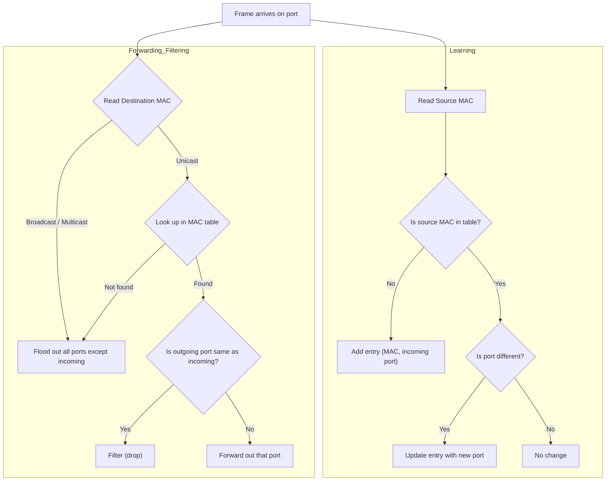

# Comprehensive Lecture: Chapter 5 – Fundamentals of Ethernet LAN Switching

## 1. Why This Chapter Is Critical

Switches are the building blocks of Ethernet LANs. Almost every device in a modern enterprise connects to a switch. Understanding **how** a switch decides to forward or drop a frame is essential for troubleshooting connectivity issues, designing loop‑free topologies, and configuring advanced features like VLANs and port security. This chapter lays the foundation for all Layer 2 switching topics you will encounter later.

---

## 2. The Three Primary Functions of a LAN Switch

A switch performs three main tasks to deliver frames from source to destination:

1. **Forwarding / Filtering** – decide whether to send a frame out a specific port or ignore it, based on the **destination MAC address**.
2. **Learning** – build and maintain a **MAC address table** (also called CAM table) by examining the **source MAC address** of every incoming frame.
3. **Loop Prevention** – use the **Spanning Tree Protocol (STP)** to block redundant links and prevent frames from looping forever.

**Analogy:** Imagine a train station (switch). Trains (frames) arrive at different platforms (ports). The station master (switch) checks the destination label (destination MAC) and looks at a big board (MAC table) to decide which platform to send the train to. If the label is not on the board, he sends copies to all platforms (flooding). Also, he records where each train came from (source MAC) to update his board. Finally, to prevent trains from circling endlessly, he sometimes closes some tracks (STP blocking).

---

## 3. Forwarding Logic – The Core Decision

### 3.1 The MAC Address Table (CAM Table)

The switch uses a table that maps **MAC addresses** to **outgoing ports**. This table is built dynamically by learning. When a frame arrives, the switch looks up the **destination MAC address** in this table.

| MAC Address    | Port  |
| :------------- | :---- |
| 0200.1111.1111 | Fa0/1 |
| 0200.2222.2222 | Fa0/2 |

If the destination MAC is **found** in the table and the outgoing port is **different** from the incoming port, the switch **forwards** the frame out that port. If the outgoing port is the **same** as the incoming port, the switch **filters** (drops) the frame – because the destination is on the same segment and already received the frame.

### 3.2 Known Unicast Frames

A **known unicast** frame is one where the destination MAC address is a unicast address (not broadcast/multicast) and is already present in the MAC table. The switch forwards it out the one matching port. This is efficient and precise.

**Example (Figure 5‑3):** Fred (MAC 0200.1111.1111) sends a frame to Barney (MAC 0200.2222.2222). The switch's table has an entry for Barney on port Fa0/2. The switch forwards the frame out Fa0/2 only.

### 3.3 Unknown Unicast Frames (Flooding)

If the destination MAC is **not** in the table, the switch does not know which port to use. It then **floods** the frame – sends copies out **all ports except the incoming port**. This ensures the frame reaches the intended device, even though it wastes bandwidth.

**Why flood?** Because the switch has no other way to deliver the frame. The destination device will eventually reply, and that reply will let the switch **learn** the destination's MAC address (source MAC of the reply) and update the table for future frames.

### 3.4 Broadcast and Multicast Frames

- **Broadcast** frames (destination MAC = FFFF.FFFF.FFFF) are always flooded to all ports (except incoming). This is necessary because broadcasts are intended for all devices.
- **Multicast** frames are also flooded by default (unless IGMP snooping is configured), but CCNA fundamentals treat them as flooded.

### 3.5 The Forwarding Decision Summary

| Destination MAC Type | Action                                                       |
| :------------------- | :----------------------------------------------------------- |
| Known unicast        | Forward out the port listed in the MAC table (if different from incoming). Filter if same port. |
| Unknown unicast      | Flood (send out all ports except incoming).                  |
| Broadcast            | Flood (send out all ports except incoming).                  |
| Multicast            | Flood by default (unless IGMP snooping is active).           |

---

## 4. Learning MAC Addresses – How the Table Is Built

Switches learn MAC addresses **dynamically** by inspecting the **source MAC address** of every incoming frame. For each frame received:

1. The switch reads the **source MAC address**.
2. It checks if this MAC is already in the table. If not, it adds a new entry with that MAC and the **incoming port**.
3. If the MAC already exists but the port is different, it updates the entry with the new port (this handles devices moving to another port).

**Example (Figure 5‑6):** When Fred sends his first frame, the switch adds Fred's MAC (0200.1111.1111) with port Fa0/1. When Barney replies, the switch adds Barney's MAC (0200.2222.2222) with port Fa0/2. Now both are known.

### 4.1 Aging and Table Management

- **Aging time** – entries are removed after a period of inactivity (default 300 seconds) to keep the table current.
- **Table full** – if the table fills, the oldest entries are removed to make space.
- **Clear command** – you can manually remove dynamic entries with `clear mac address-table dynamic`.

### 4.2 Static MAC Entries

You can also manually configure static MAC entries (e.g., for security), but the default behavior is dynamic learning.

---

## 5. Avoiding Loops – The Spanning Tree Protocol (STP)

In networks with redundant links (multiple switches connected in a loop), flooding can cause frames to loop forever, consuming all bandwidth. **STP** is a protocol that runs on switches to detect and block redundant paths, leaving only one active path between any two switches. It does this by placing some ports in a **blocking** state (they do not forward frames) while others are in **forwarding** state. STP is covered in depth in Chapter 9, but you need to know that it is **enabled by default** on Cisco switches.

**Analogy:** Imagine several roundabouts connected by roads. Without traffic lights (STP), cars (frames) could circle forever. STP is like a set of temporary road closures that ensure there is only one route between any two points, preventing endless loops.

---

## 6. Putting It All Together – A Multi‑Switch Example

When multiple switches are interconnected, each switch independently makes its own forwarding and learning decisions. A frame may traverse several switches; at each hop, the switch looks at the destination MAC, finds it in its own table (or floods), and forwards accordingly. The MAC tables on each switch contain entries for devices that are reachable **from that switch's perspective**.

**Example (Figure 5‑10):** Two switches SW1 and SW2. Hosts on the left (Fred, Barney) connect to SW1; hosts on the right (Wilma, Betty) connect to SW2. After traffic flows, SW1 will learn the MACs of Fred and Barney on its local ports, but it will also learn the MACs of Wilma and Betty on its uplink port (Gi0/1) because frames from those hosts enter SW1 via that port. Similarly, SW2 will learn the left‑side MACs on its uplink port (Gi0/2). The tables are specific to each switch's local view.

---

## 7. Verification Commands – Seeing the Switch in Action

Cisco IOS provides several `show` commands to check the switch's status, MAC table, and port states.

### 7.1 `show mac address-table dynamic`

This command displays all dynamically learned MAC addresses, their associated VLAN, type (dynamic), and port.

**Example Output:**

```
SW1# show mac address-table dynamic
Vlan    Mac Address       Type        Ports
----    -----------       --------    -----
  1     0200.1111.1111    DYNAMIC     Fa0/1
  1     0200.2222.2222    DYNAMIC     Fa0/2
  1     0200.3333.3333    DYNAMIC     Fa0/3
  1     0200.4444.4444    DYNAMIC     Fa0/4
```

You can filter by VLAN, interface, or specific MAC address using keywords:

- `show mac address-table dynamic vlan <vlan-id>`
- `show mac address-table dynamic interface <interface>`
- `show mac address-table dynamic address <mac-address>`

### 7.2 `show interfaces status`

This shows the operational state of each interface:

- **connected** – a cable is plugged in and the link is up.
- **notconnect** – no cable or the link is down.
- **disabled** – administratively shut down.

**Example:**

```
SW1# show interfaces status
Port      Name               Status       Vlan       Duplex  Speed Type
Fa0/1                        connected    1          a-full  a-100 10/100BaseTX
Fa0/2                        connected    1          a-full  a-100 10/100BaseTX
Fa0/3                        connected    1          a-full  a-100 10/100BaseTX
Fa0/4                        connected    1          a-full  a-100 10/100BaseTX
Fa0/5                        notconnect   1          auto    auto  10/100BaseTX
...
```

### 7.3 `show interfaces <port> counters`

Displays statistics on frames received and transmitted (unicast, broadcast, multicast, errors). Useful for troubleshooting traffic volume.

### 7.4 `clear mac address-table dynamic`

Clears dynamically learned entries. Useful for forcing the switch to relearn after topology changes (or in labs).

---

## 8. Conceptual Relationship Map

Below is a Mermaid diagram that illustrates the core logic of a switch:



---

## 9. Connections to Other Chapters

- **Chapter 2 (Ethernet LANs)** – introduced the Ethernet frame format and MAC addresses; this chapter puts them to work.
- **Chapter 4 (CLI)** – you now use the CLI commands (`show mac address-table`, etc.) to verify the concepts.
- **Chapter 8 (VLANs)** – expands on switching by introducing VLANs, which separate traffic into different broadcast domains; the MAC table will include VLAN information.
- **Chapter 9 (STP)** – dives deep into Spanning Tree Protocol, explaining how switches calculate which ports to block.
- **Chapter 7 (Configuring Switch Interfaces)** – you will learn to adjust port settings like speed/duplex, which affect the learning/forwarding process.

---

## 10. Summary, Key Takeaways & Study Advice

### 10.1 Core Takeaways

1. **A switch's primary job is to forward frames** based on destination MAC addresses.
2. **MAC address table** is the heart of switching – it maps MACs to ports and is built by **learning** source MACs from incoming frames.
3. **Known unicasts** are forwarded out one port; **unknown unicasts and broadcasts** are **flooded** out all ports (except incoming).
4. **STP** is enabled by default to prevent loops in redundant topologies.
5. **Verification commands** – `show mac address-table dynamic` and `show interfaces status` are your go‑to tools.

### 10.2 Common Pitfalls

- **Forgetting that switches flood unknown unicasts** – this is a normal behavior, not a bug.
- **Mixing up MAC learning (source MAC) with forwarding (destination MAC)** – remember: learning looks at **source**, forwarding looks at **destination**.
- **Thinking STP is optional** – it's on by default and critical; if you disable it and create a loop, the network will collapse.
- **Confusing `show mac address-table` with `show arp`** – ARP is for IP‑to‑MAC mapping on hosts/routers, not for switch forwarding.

### 10.3 Study Advice

1. **Practice in Packet Tracer or real gear:** Connect two PCs to a switch, send pings, and watch the MAC table grow using `show mac address-table dynamic`. Then disconnect a PC and see the entry age out.
2. **Trace frame flow:** Draw a topology with two switches and four PCs. For each PC's first ping, determine which ports flood and which forward, and how the tables update.
3. **Play with `clear mac address-table dynamic`** and see how the table repopulates.
4. **Use the `show interfaces status`** command to verify that your cabling is correct – a 'notconnect' means something is unplugged or broken.

---

## Appendix A: Command Reference

| Command                                                 | Mode            | Purpose / Description                                        |
| :------------------------------------------------------ | :-------------- | :----------------------------------------------------------- |
| `show mac address-table`                                | Any EXEC        | Lists all MAC table entries (static and dynamic).            |
| `show mac address-table dynamic`                        | Any EXEC        | Lists only dynamically learned entries.                      |
| `show mac address-table dynamic vlan <vlan-id>`         | Any EXEC        | Lists dynamic entries for a specific VLAN.                   |
| `show mac address-table dynamic interface <interface>`  | Any EXEC        | Lists dynamic entries associated with a specific port.       |
| `show mac address-table dynamic address <mac-address>`  | Any EXEC        | Shows entry for a specific MAC address (if present).         |
| `show interfaces status`                                | Any EXEC        | Displays the operational state (connected/notconnect/disabled) and settings of all ports. |
| `show interfaces <port> counters`                       | Any EXEC        | Shows frame statistics for a specific port (unicast, broadcast, errors, etc.). |
| `clear mac address-table dynamic`                       | Privileged EXEC | Removes all dynamically learned MAC entries.                 |
| `clear mac address-table dynamic vlan <vlan-id>`        | Privileged EXEC | Removes dynamic entries for a specific VLAN.                 |
| `clear mac address-table dynamic interface <interface>` | Privileged EXEC | Removes dynamic entries learned on a specific port.          |
| `clear mac address-table dynamic address <mac-address>` | Privileged EXEC | Removes a specific dynamic entry.                            |
| `mac address-table aging-time <seconds> [vlan <vlan>]`  | Global Config   | Changes the aging time for dynamic entries (default 300 seconds). |

---

## Appendix B: Glossary of Key Terms (English – Chinese)

| English Term                         | Chinese Translation | Brief Explanation                                            |
| :----------------------------------- | :------------------ | :----------------------------------------------------------- |
| **MAC address table**                | MAC地址表 / CAM表   | Table in a switch mapping MAC addresses to ports; used for forwarding decisions. |
| **CAM (Content‑Addressable Memory)** | 内容可寻址存储器    | Special high‑speed memory used to store the MAC table.       |
| **Known unicast**                    | 已知单播帧          | Frame whose destination MAC is found in the MAC table.       |
| **Unknown unicast**                  | 未知单播帧          | Frame whose destination MAC is **not** found; the switch floods it. |
| **Broadcast frame**                  | 广播帧              | Frame destined to MAC FFFF.FFFF.FFFF; always flooded.        |
| **Multicast frame**                  | 组播帧              | Frame destined to a group MAC address; flooded by default (without IGMP snooping). |
| **Flooding**                         | 泛洪                | Forwarding a frame out all ports except the incoming port.   |
| **Filtering**                        | 过滤                | Not forwarding a frame (e.g., when destination is on the same port as source). |
| **Forwarding**                       | 转发                | Sending a frame out a specific port toward its destination.  |
| **Learning**                         | 学习                | The process of adding a source MAC address to the table along with its incoming port. |
| **Aging**                            | 老化                | Removing a MAC entry after a period of inactivity.           |
| **Spanning Tree Protocol (STP)**     | 生成树协议          | Protocol that blocks redundant links to prevent Layer 2 loops. |
| **VLAN**                             | 虚拟局域网          | A logical segmentation of a LAN; switches forward frames only within the same VLAN. |
| **Dynamic entry**                    | 动态条目            | A MAC table entry learned automatically from incoming frames. |
| **Static entry**                     | 静态条目            | A manually configured MAC table entry.                       |
| **Connected state**                  | 连接状态            | Interface status meaning a cable is plugged and the link is up. |
| **Notconnect state**                 | 未连接状态          | Interface status meaning no cable or the link is down.       |
| **Disable**                          | 禁用                | Interface is administratively shut down (no traffic).        |
| **Clear**                            | 清除                | Command to remove dynamic MAC table entries.                 |
